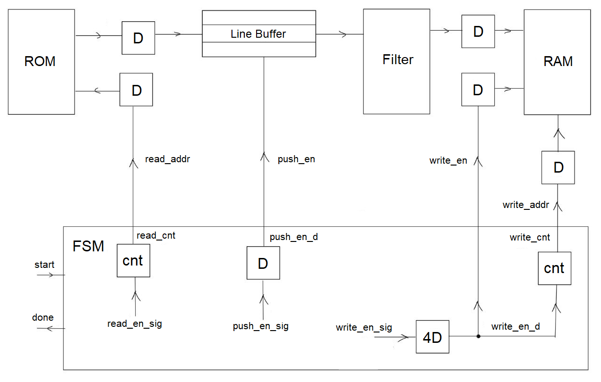
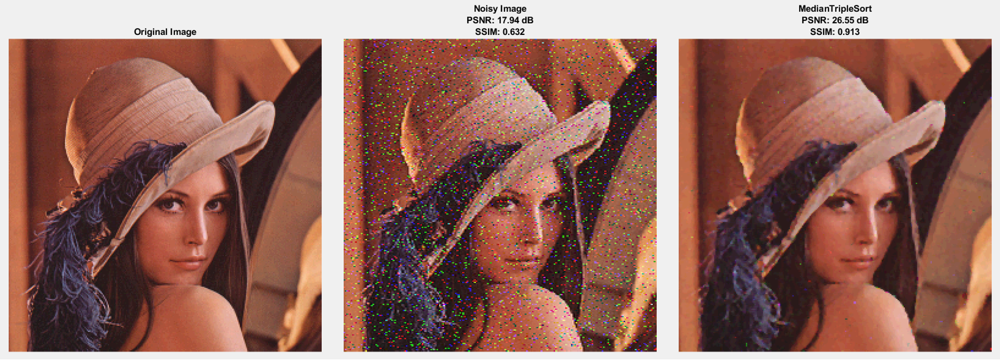

# VHDL median filter

VHDL implementation of a 3×3 median filter for 256×256 RGB images, targeting the Altera Cyclone IV FPGA.  
Lightweight, fully pipelined design for real-time image processing on hardware.

